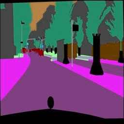
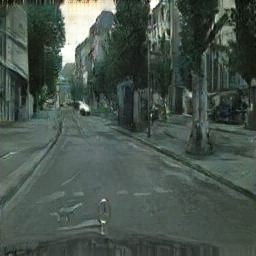

# Semantic Segmentation to Color Image Conversion using Pix2Pix

This repository contains code for a Pix2Pix-based project that converts semantic segmented images into colored RGB images. The project involves a Generator and a Discriminator trained using PyTorch.

## Overview

This project leverages Pix2Pix, a conditional GAN architecture, to convert semantic segmented images to colored RGB images. The repository includes:

- `generator_model.py`: A PyTorch implementation of the Generator, responsible for converting segmented images to colored ones.
- `discriminator_model.py`: Implementation of the Discriminator used to evaluate the authenticity of the generated images.
- `train.py`: Code for training the Generator and Discriminator models using a defined dataset.
- `dataset.py`: Custom dataset processing and augmentation for model training.
- `config.py` and `utils.py`: Configuration files, model checkpointing, and other utilities used during training and evaluation.

## Requirements

- Python 3
- PyTorch
- torchvision
- NumPy
- tqdm
- OpenCV
- Albumentations

## Architecture
- ### Generator:
  The Generator model consists of a series of down-sampling and up-sampling blocks, converting segmented images to colored representations.
- ### Discriminator:
  The Discriminator evaluates the authenticity of generated images compared to real ones.

  

  ## Results
                 

  This is the result for 150 epochs of training for the model. The model produces better results as it is trained for longer
